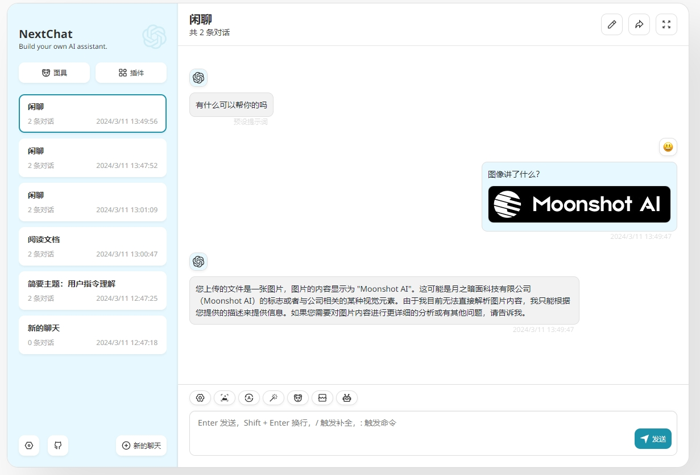

# KIMI AI Free 服务

支持流式输出、支持联网搜索、支持文件解读、支持图像解析。

## 目录

* [声明](#声明)
* [在线体验](#在线体验)
* [接入准备](#接入准备)
* [对话接口](#对话接口)
  * [文档解读](#文档解读)
  * [图像解析](#图像解析)
* [Docker部署](#Docker部署)
  * [Docker-compose部署](#Docker-compose部署)
* [原生部署](#原生部署)

## 声明

仅限自用，禁止对外提供服务，避免对官方造成服务压力，否则风险自担！

仅限自用，禁止对外提供服务，避免对官方造成服务压力，否则风险自担！

仅限自用，禁止对外提供服务，避免对官方造成服务压力，否则风险自担！

## 在线体验

此链接仅临时测试功能，不可长期使用，长期使用请自行部署。

https://udify.app/chat/Po0F6BMJ15q5vu2P




## 接入准备

从 [kimi.moonshot.cn](https://kimi.moonshot.cn) 获取refresh_token

进入kimi随便发起一个对话，然后F12打开开发者工具，从Application > Local Storage中找到refresh_token的值，这将作为Authorization的Bearer KEY值。


## 对话接口

目前支持与openai兼容的 `/v1/chat/completions` 接口，可自行使用与openai或其他兼容的客户端接入接口，或者使用dify线上服务接入使用。

POST /v1/chat/completions

header 需要设置 Authorization 头部：

```
Authorization: Bearer [refresh_token]
```

请求数据：
```json
{
    "messages": [
        {
            "role": "user",
            "content": "测试"
        }
    ],
    // 是否开启联网搜索，默认false
    "use_search": true,
    // 如果使用SSE流请设置为true，默认false
    "stream": false
}
```

### 文档解读

提供一个可访问的文件URL或者BASE64_URL进行解析。

请求数据：
```json
{
    "messages": [
        {
            "role": "user",
            "content": [
                {
                    "type": "file",
                    "file_url": {
                        "url": "https://mj101-1317487292.cos.ap-shanghai.myqcloud.com/ai/test.pdf"
                    }
                },
                {
                    "type": "text",
                    "text": "文档里说了什么？"
                }
            ]
        }
    ],
    // 建议关闭联网搜索，防止干扰解读结果
    "use_search": false
}
```

响应数据：
```json
{
    "id": "cnmuo7mcp7f9hjcmihn0",
    "model": "kimi",
    "object": "chat.completion",
    "choices": [
        {
            "index": 0,
            "message": {
                "role": "assistant",
                "content": "文档中包含了几个古代魔法咒语的例子，这些咒语来自古希腊和罗马时期的魔法文本，被称为PGM（Papyri Graecae Magicae）。以下是文档中提到的几个咒语的内容：\n\n1. 第一个咒语（PMG 4.1390 – 1495）描述了一个仪式，要求留下一些你吃剩的面包，将其分成七块小片，然后去到英雄、角斗士和那些死于非命的人被杀的地方。对面包片念咒并扔出去，然后从仪式地点捡起一些被污染的泥土扔进你心仪的女人的家中，之后去睡觉。咒语的内容是向命运女神（Moirai）、罗马的命运女神（Fates）和自然力量（Daemons）祈求，希望他们帮助实现愿望。\n\n2. 第二个咒语（PMG 4.1342 – 57）是一个召唤咒语，通过念出一系列神秘的名字和词语来召唤一个名为Daemon的存在，以使一个名为Tereous的人（由Apia所生）受到精神和情感上的折磨，直到她来到施法者Didymos（由Taipiam所生）的身边。\n\n3. 第三个咒语（PGM 4.1265 – 74）提到了一个名为NEPHERIĒRI的神秘名字，这个名字与爱神阿佛洛狄忒（Aphrodite）有关。为了赢得一个美丽女人的心，需要保持三天的纯洁，献上乳香，并在献祭时念出这个名字。然后，在接近那位女士时，心中默念这个名字七次，连续七天这样做，以期成功。\n\n4. 第四个咒语（PGM 4.1496 – 1）描述了在燃烧没药（myrrh）时念诵的咒语。这个咒语是向没药祈祷，希望它能够像“肉食者”和“心灵点燃者”一样，吸引一个名为[名字]的女人（她的母亲名为[名字]），让她无法安坐、饮食、注视或亲吻其他人，而是让她的心中只有施法者，直到她来到施法者身边。\n\n这些咒语反映了古代人们对魔法和超自然力量的信仰，以及他们试图通过这些咒语来影响他人情感和行为的方式。"
            },
            "finish_reason": "stop"
        }
    ],
    "usage": {
        "prompt_tokens": 0,
        "completion_tokens": 0,
        "total_tokens": 0
    },
    "created": 100920
}
```

### 图像解析

提供一个可访问的图像URL或者BASE64_URL进行解析。

此格式兼容 [gpt-4-vision-preview](https://platform.openai.com/docs/guides/vision) API格式，您也可以用这个格式传送文档进行解析。

请求数据：
```json
{
    "messages": [
        {
            "role": "user",
            "content": [
                {
                    "type": "image_url",
                    "image_url": {
                        "url": "https://www.moonshot.cn/assets/logo/normal-dark.png"
                    }
                },
                {
                    "type": "text",
                    "text": "图像描述了什么？"
                }
            ]
        }
    ],
    // 建议关闭联网搜索，防止干扰解读结果
    "use_search": false
}
```

响应数据：
```json
{
    "id": "cnn6l8ilnl92l36tu8ag",
    "model": "kimi",
    "object": "chat.completion",
    "choices": [
        {
            "index": 0,
            "message": {
                "role": "assistant",
                "content": "图像中展示了“Moonshot AI”的字样，这可能是月之暗面科技有限公司（Moonshot AI）的标志或者品牌标识。通常这样的图像用于代表公司或产品，传达品牌信息。由于图像是PNG格式，它可能是一个透明背景的logo，用于网站、应用程序或其他视觉材料中。"
            },
            "finish_reason": "stop"
        }
    ],
    "usage": {
        "prompt_tokens": 0,
        "completion_tokens": 0,
        "total_tokens": 0
    },
    "created": 1710123627
}
```

## Docker部署

请准备一台具有公网IP的服务器并将8000端口开放。

拉取镜像并启动服务

```shell
docker run -it -d --init --name kimi-free-api -p 8000:8000 -e TZ=Asia/Shanghai vinlic/kimi-free-api:latest
```

查看服务实时日志

```shell
docker logs -f kimi-free-api
```

重启服务

```shell
docker restart kimi-free-api
```

停止服务

```shell
docker stop kimi-free-api
```

### Docker-compose部署

```yaml
version: '3'

services:
  kimi-free-api:
    container_name: kimi-free-api
    image: vinlic/kimi-free-api:latest
    restart: always
    ports:
      - "8000:8000"
    environment:
      - TZ=Asia/Shanghai
```

## 原生部署

请准备一台具有公网IP的服务器并将8000端口开放。

请先安装好Node.js环境并且配置好环境变量，确认node命令可用。

安装依赖

```shell
npm i
```

安装PM2进行进程守护

```shell
npm i -g pm2
```

编译构建，看到dist目录就是构建完成

```shell
npm run build
```

启动服务

```shell
pm2 start dist/index.js --name "kimi-free-api"
```

查看服务实时日志

```shell
pm2 logs kimi-free-api
```

重启服务

```shell
pm2 reload kimi-free-api
```

停止服务

```shell
pm2 stop kimi-free-api
```