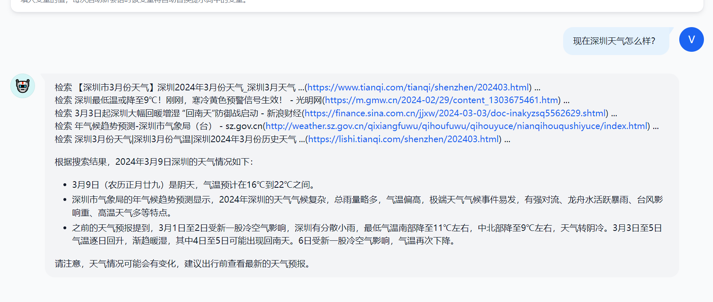

# KIMI AI Free 服务

## 声明

仅限自用，禁止对外提供服务，否则风险自担！

仅限自用，禁止对外提供服务，否则风险自担！

仅限自用，禁止对外提供服务，否则风险自担！

## 在线体验

此链接仅临时测试功能，不可长期使用，长期使用请自行部署。

https://udify.app/chat/Po0F6BMJ15q5vu2P




## 接入准备

从 [kimi.moonshot.cn](https://kimi.moonshot.cn) 获取refresh_token：进入kimi随便发起一个对话，然后F12打开开发者工具，从Application > Local Storage中找到refresh_token的值，这将作为API_KEY。

## Docker部署

拉取镜像

```shell
docker pull vinlic/kimi-free-api:latest
```

启动服务

```shell
docker run -it -d --init --name kimi-free-api -p 8000:8000 vinlic/kimi-free-api:latest
```

查看服务实时日志

```shell
docker logs -f kimi-free-api
```

重启服务

```shell
docker restart kimi-free-api
```

停止服务

```shell
docker stop kimi-free-api
```

## 原生部署

请先安装好Node.js环境并且配置好环境变量，确认node命令可用。

安装依赖

```shell
npm i
```

安装PM2进行进程守护

```shell
npm i -g pm2
```

编译构建，看到dist目录就是构建完成

```shell
npm run build
```

启动服务

```shell
pm2 start dist/index.js --name "kimi-free-api"
```

查看服务实时日志

```shell
pm2 logs kimi-free-api
```

重启服务

```shell
pm2 reload kimi-free-api
```

停止服务

```shell
pm2 stop kimi-free-api
```

## 发起请求

目前支持与openai兼容的 `/v1/chat/completions` 接口

POST /v1/chat/completions

header 需要设置 Authorization 头部：

```
Authorization: Bearer [refresh_token]
```

JSON数据：

```json
{
    "messages": [
        {
            "role": "user",
            "content": "测试"
        }
    ],
    // 如果使用SSE流请设置为true
    "stream": false
}
```

## 部署

请准备一台具有公网IP的服务器，按照[安装](#安装)步骤部署好服务并将8000端口开放。

自行使用与openai或其他兼容的客户端接入接口。

或者使用dify线上服务接入使用。